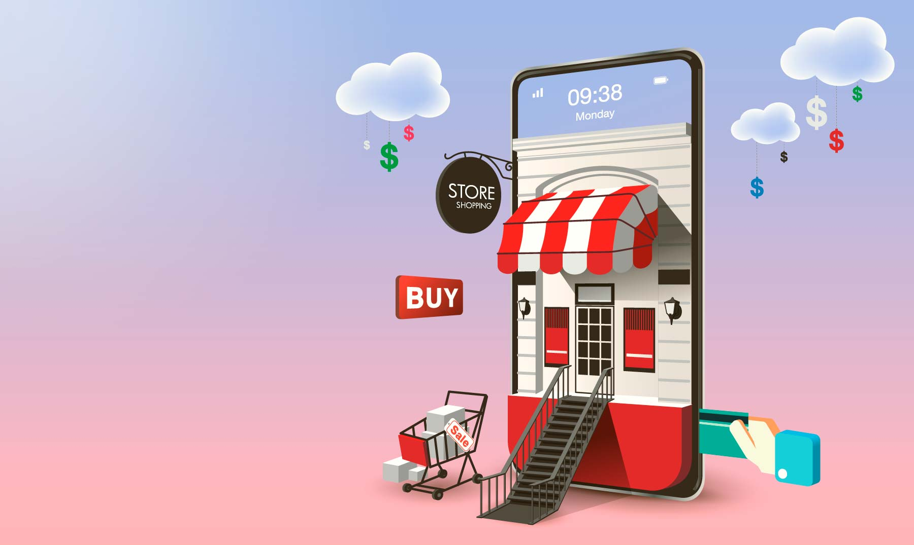

 

#  Buscador "Shopline"

Este es mi 4to proyecto presentado en la cursada de Desarrollo FronteEnd en Ada

 

  

##  Objetivo 

En este proyecto el objetivo era trabajar con una APi publica y poner en practica lo aprendido en SASS

  

  

##  Funcionalidades 
Este trabajo esta realizadon con la API publica de [Mercado Libre](https://developers.mercadolibre.com.ar/es_ar) y te permite realizar las siguientes busquedas:

<ul>
<li>Buscar por artículo</li>
<li>Buscar por categoría</li>
<li>Filtrar búsqueda por Envios Gratis</li>
<li>Ordenar búsqueda por Precio o Relevancia</li>
<li>Ver en cada articulo sus fotos, precio, forma de envio, garantia y pago con Mercado Pago </li>
</ul>

  

  

##  Tecnologias 

  

  

##  Acceso

Para acceder al proyecto [Click aqui](https://ceciliarr.github.io/Buscador/) 
 
 
Espero que lo disfruten!! 

 
 

#

